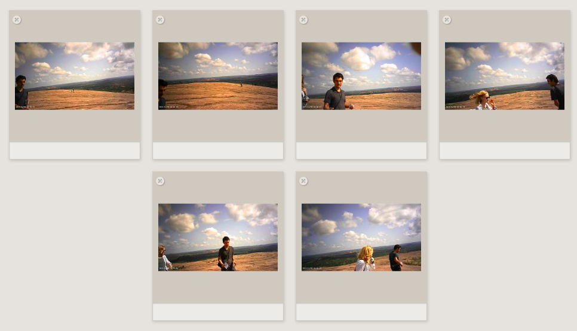

# Highlights

Highlights is a software that detects the best moments of a video. You can transform a long video to a set of images retracing the best shots using simple AI. Ideal for GoPros or any devices that records hours of videos and for which you want to be able to get a gallery of the top quality images as well as storing it at a much lower space toll than with the original format.



## How does it work?

Multiple steps are necessary. The very first step is the conversion of the provided video to a set of images. These images will then go through two convolutional neural networks: one for technical aspects (blurry, on focus, etc...), and one for quality (ex: objects recognition). We keep just of small amount of images from the initial set (above 85% percentile for technical aspects, and 70% percentile for aesthetic).

## How to use highlights?

You need to have <a href="https://www.docker.com/">Docker</a> and <b>ffmpeg</b> installed in your local machine. The rest will happen within the container.

First, set the following environment variables in your local machine:

```sh
HIGHTLIGHTS_SOURCE_PATH (where all your *.mp4 are located)
HIGHTLIGHTS_OUTPUT_PATH (where you want the data to be outputted)
```

Then those are the relevant commands to use the software. You must be at the root of the project:

```sh
mave vendor (build the docker image, first time use only)
python3 bulk.py --jobs <num_videos_to_process> (process a given number of videos)
```

For each video processed, there will be a directory created with the best images found, a timelapse of the original video at a 6x speed, and the original sound in mp3.

In case your file is too large, the process will automatically cut it in half.

## Additional commands

```sh
make sd (get list of videos from the sources)
make assets path="<video_path>" (creates mp3 + timelapse only)
make clean (clean temporary images)
```

## Credits

Credits to https://github.com/idealo/image-quality-assessment under Apache-2.0 License for which the code is partially used in this project.
